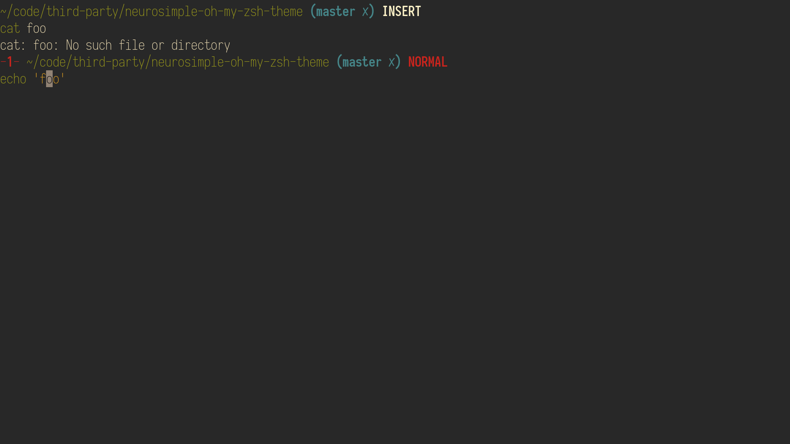

# Neuro Simple's theme for oh-my-zsh

## Description



This is a very simple theme inspired by [oh-my-zsh/simple.zsh-theme at master · robbyrussell/oh-my-zsh](https://github.com/robbyrussell/oh-my-zsh/blob/master/themes/simple.zsh-theme)

## Features

- Show exit status of previous command on error.
- Show current vi mode (INSERT, NORMAL).
- Show current git branch name and dirty state.
- Double line prompt

## Installation

Copy `neurosimple.zsh-theme` to `$ZSH_CUSTOM/themes`:

```sh
sudo cp neurosimple.zsh-theme $ZSH_CUSTOM/themes/
```

In your `.zshrc`:

```zsh
...
ZSH_THEME="neurosimple"
plugins=(git)
...
```

## License

This is released under the [MIT license](LICENSE.md).
